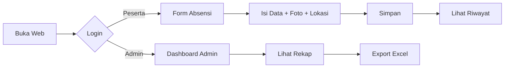

# 📋 SIHADIR MPP

<div align="center">


**Sistem Informasi Kehadiran Digital untuk Peserta Magang, PKL, dan Penelitian**

[Demo](#demo) • [Fitur](#-fitur) • [Instalasi](#-instalasi) • [Penggunaan](#-penggunaan) • [Kontributor](#-kontributor)

</div>

---

## ✨ Fitur

| Fitur | Deskripsi |
|-------|-----------|
| 🔐 **Multi-Role Login** | Login terpisah untuk Admin dan Peserta |
| 📸 **Selfie Absensi** | Ambil foto langsung dari kamera dengan watermark otomatis |
| 📍 **Deteksi Lokasi GPS** | Rekam koordinat dan akurasi lokasi saat absen |
| 🤖 **Analisis AI** | Deteksi keterlambatan dan validasi lokasi otomatis |
| 📄 **Upload Surat Izin** | Upload file surat izin/sakit (PDF/Image) |
| 📊 **Export Excel** | Rekap absensi dalam format Excel |
| 📱 **QR Code Access** | Generate QR code untuk akses mudah dari HP |
| 🌐 **Remote Access** | Akses dari mana saja via Cloudflare Tunnel |

---

## 🛠️ Teknologi

<table>
<tr>
<td align="center"><br><b>PHP 8.x</b></td>
<td align="center"><br><b>MySQL</b></td>
<td align="center"><br><b>Bootstrap 5</b></td>
<td align="center"><br><b>JavaScript</b></td>
</tr>
</table>

**Library & Tools:**
- 📦 **Bootstrap 5** - UI Framework
- 🎨 **Font Awesome 6** - Icon Library
- 🔤 **Google Fonts** (Poppins, Inter) - Typography
- 📷 **MediaDevices API** - Kamera Browser
- 🗺️ **Geolocation API** - GPS Location
- 🔲 **QRServer API** - QR Code Generator

---

## 🚀 Instalasi

### Prasyarat
- [XAMPP](https://www.apachefriends.org/) / [Laragon](https://laragon.org/) / Web server dengan PHP & MySQL
- PHP 7.4 atau lebih tinggi
- MySQL 5.7 atau lebih tinggi

### Langkah Instalasi

**1. Clone Repository**
```bash
git clone https://github.com/eLsann/sihadirmpp.git
```

**2. Pindahkan ke Web Server**
```bash
# Untuk XAMPP
mv sihadirmpp C:/xampp/htdocs/

# Untuk Laragon
mv sihadirmpp C:/laragon/www/
```

**3. Buat File Konfigurasi**

Buat file `config.php` di root folder:
```php
<?php
$host = "localhost";
$user = "root";
$pass = "";  // Kosong untuk default XAMPP/Laragon
$db   = "sihadir_mpp";

$conn = mysqli_connect($host, $user, $pass, $db);

if (!$conn) {
    die("Koneksi database gagal: " . mysqli_connect_error());
}

date_default_timezone_set('Asia/Jakarta');
if (session_status() === PHP_SESSION_NONE) { session_start(); }
?>
```

**4. Import Database**

- Buka phpMyAdmin atau HeidiSQL
- Buat database baru: `sihadir_mpp`
- Import file `database.sql`

**5. Buat Folder Uploads**
```bash
mkdir uploads
```

**6. Jalankan Aplikasi**
```
http://localhost/sihadirmpp/
```

---

## 📖 Penggunaan

### Login

| Role | Username | Password |
|------|----------|----------|
| 👨‍💼 Admin | `admin` | `admin123` |
| 👤 Peserta | `peserta1` | `peserta123` |

### Alur Penggunaan



### Akses via QR Code

1. Buka `/qrcode.php`
2. Scan QR code dari HP
3. Langsung menuju halaman login

### Akses Remote (Cloudflare Tunnel)

```bash
# Install cloudflared
winget install Cloudflare.cloudflared

# Jalankan tunnel
cloudflared tunnel --url http://localhost:80
```

---

## 📁 Struktur Folder

```
sihadirmpp/
├── assets/
│   └── css/
│       └── style.css       # Custom styles
├── uploads/                 # Folder foto & surat (gitignore)
├── admin.php               # Dashboard admin
├── config.php              # Konfigurasi database (gitignore)
├── dashboard.php           # Dashboard peserta + form absensi
├── database.sql            # Struktur database
├── ekspor_excel.php        # Export rekap ke Excel
├── export.php              # Export ke CSV
├── hapus.php               # Handler hapus data
├── hapus_masal.php         # Handler hapus massal
├── index.php               # Halaman login utama
├── login.php               # Halaman login alternatif
├── logout.php              # Handler logout
├── proses.php              # Proses absensi alternatif
├── proses_absen.php        # Proses utama absensi
├── qrcode.php              # Generate QR code
└── README.md
```

---

## 🔒 Keamanan

> ⚠️ **Catatan untuk Production:**
> - Ganti password default sebelum deploy
> - Gunakan HTTPS
> - Pertimbangkan implementasi `password_hash()` untuk keamanan lebih

---

## 👥 Kontributor

<table>
<tr>
<td align="center">
<b>Aulia Annisa</b><br>
<a href="https://github.com/auliaannisa">@auliaannisa</a><br>
<i>Original Creator</i>
</td>
<td align="center">
<b>eLsann</b><br>
<a href="https://github.com/eLsann">@eLsann</a><br>
<i>Contributor</i>
</td>
</tr>
</table>

---

## 📄 Lisensi

Project ini dibuat untuk keperluan pendidikan dan dapat digunakan secara bebas.

---

<div align="center">

**SIHADIR MPP** © 2026 - Sistem Hadir Digital untuk BKPSDM

Made with ❤️ by Aulia Annisa

</div>
